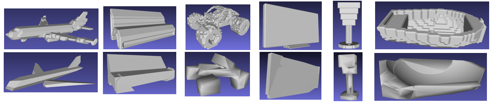

# UCSGNet: Unsupervised Discovering of Constructive Solid Geometry Tree
Reproducing Published Papers  
UCSGNet: Unsupervised Discovering of Constructive Solid Geometry Tree [PaperLink](https://arxiv.org/abs/2006.09102)  

Used author codes: Data loader, visualizer

## Reproducing the results
### Requirements
We give the requirements file in the repository. Run below to install them.
```
conda create -n ucsgnet python=3.8
activate ucsgnet
pip install -r requirements.txt
```
Note that in order to run 3D visualization codes, you will have to install pymesh2 manually following [here](https://pymesh.readthedocs.io/en/latest/installation.html)
not using pip (pip is outdated)


### Download Dataset
We use 2D CAD same as [CSGNet](https://github.com/hippogriff/CSGNet) and 3D ShapeNet same as [IM-NET](https://github.com/czq142857/IM-NET).All the data can be downloaded [here](https://drive.google.com/drive/folders/17oMAKif1YWAhzOBSvURo6C2vvNgtrS_H?usp=sharing)  

### Data Path Configuration
All the data file should be placed same as the below.  
- data/
  - cad/
    - cad.h5
  - hdf5/
    - all_vox256_img_test.hdf5
    - all_vox256_img_test.txt
    - all_vox256_img_train.hdf5
    - all_vox256_img_train.txt
    - all_vox256_img_z.hdf5
  - pointcloud_surface/
    - 02691156/ . . .
    - . . .  

### Train/Evaluate with 2D CAD dataset
To train the network with 2D CAD dataset, run below
```
python3 cad_train.py
```
Evaluation(Chamfer Distance) will be shown with the training  

### Train with 3D ShapeNet dataset
To train the network with 3D ShapeNet dataset, run below
```
python3 3d_train.py
```

### Loading pretrained files
You can load the pretrained files trained by me.
Here is the [file](https://drive.google.com/drive/folders/1N1fxEVAoGflmhCyx8nt0G8JvgKdxLftd?usp=sharing)  
After downloading files or training your network,
put the train files like below to visualize  
- trained_results/
  - 3d/
    - 3d_best.pth
  - cad/
    - cad_best.pth

### Visualize 2D trained network
To visualize the 2D trained network (get .png files), run below
```
python3 cad_visual.py
```

### Visualize/Evaluate 3D trained network
To visualize the 3D trained network (get .ply, .obj point cloud, mesh files), run below
```
python3 3d_visual.py
```
If the rendering takes too long, you can lower the sphere_complexity in 3d_visual.py file.   
If you want to look at the reconstructed results, you will need some rendering software such as [meshlab](https://www.meshlab.net/)  

And to evaluate the network with Chamfer Distance, run below (Note that you have to run 3d_visual.py before running below codes)
```
python3 3d_generate.py
python3 3d_eval.py
```

### Examples
Example of 3D reconsturcted shapes are shown here.


TimeLine:  
5/5 ∼ 5/19: Implement data generator, encoder, decoder, shapeeval, converter   
5/19 ∼ 5/26: Implement rest of the model, utility functions(i.e. loss, gumbelsoftmax, etc)  
5/26 ~ 6/3: Establish whole pipline and test, visualize them  
6/3 ∼ 6/6: Make reports, poster, organize codes  
